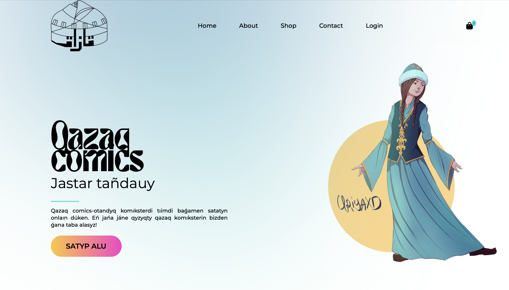
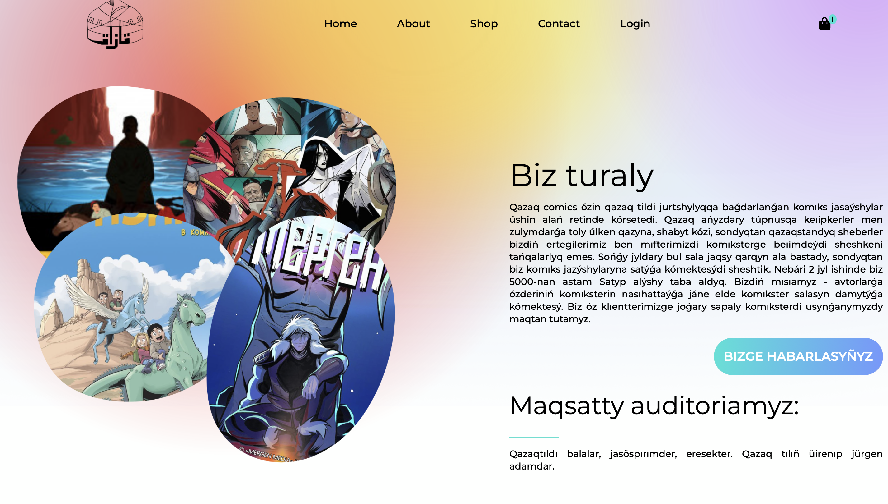
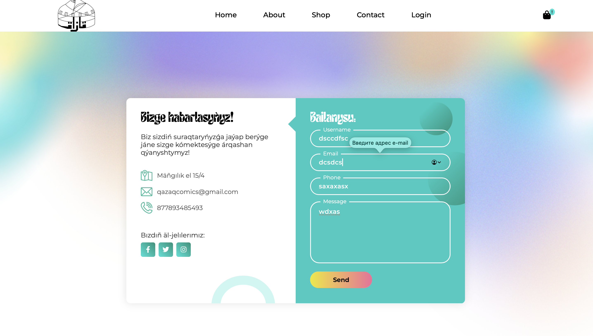
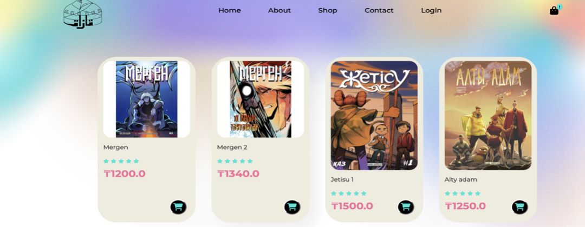
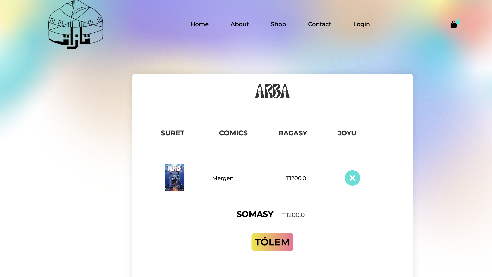
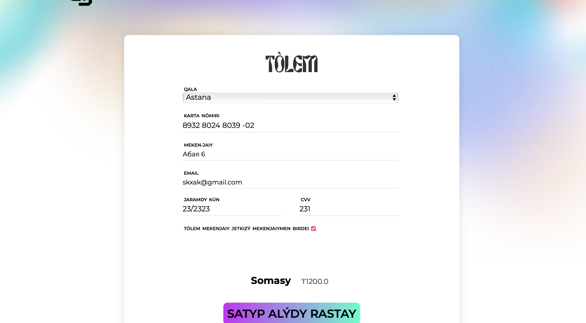
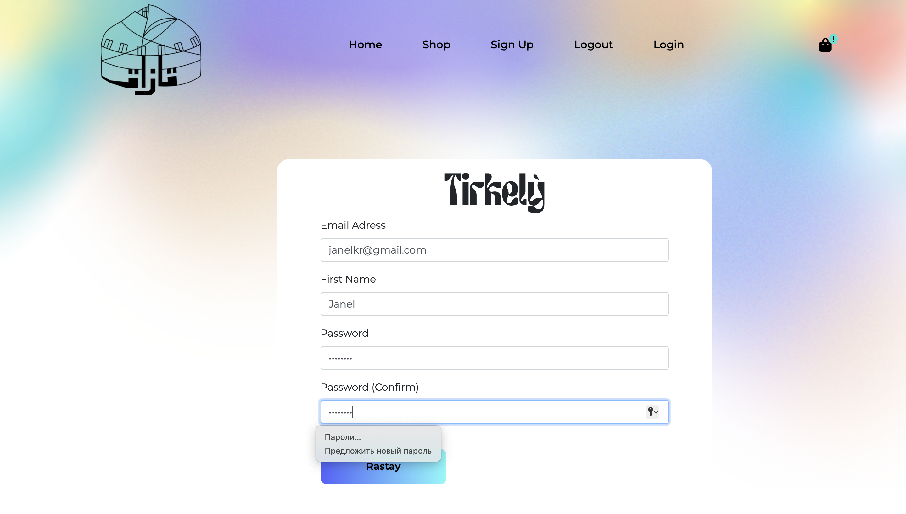
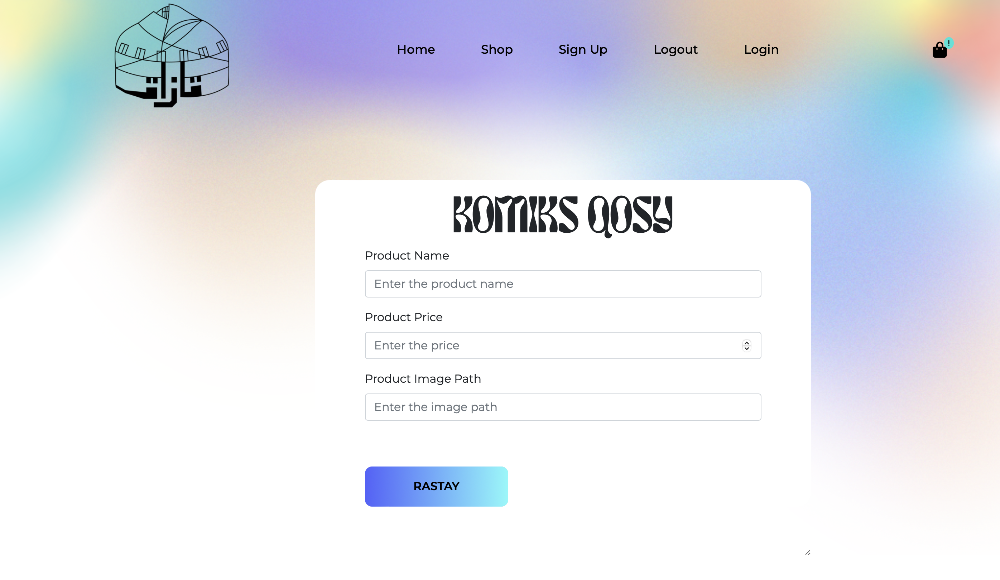

# flask-comics-store
# 🛒 Магазин комиксов на Flask

## 📌 Описание проекта

Этот проект представляет собой **онлайн-магазин казахских комиксов**, разработанный на **Flask** с использованием **HTML, CSS, JavaScript и SQLAlchemy**. Платформа позволяет пользователям просматривать каталог комиксов, добавлять их в корзину, совершать покупки и связываться с администрацией сайта.

## 🔹 Функционал

✅ Регистрация и авторизация пользователей (Flask-Login)\
✅ Просмотр каталога комиксов\
✅ Добавление товаров в корзину\
✅ Добавление новых комиксов в базу (администратор)\
✅ Оформление заказов\
\
✅ Обратная связь с администрацией\
✅ Безопасность и защита данных (хэширование паролей)\
✅ Навигация по сайту с работающими кнопками (перенаправление между страницами)\
✅ Динамическое обновление контента без перезагрузки страницы

#
### 🏠 Главная страница


### ℹ️ О нас


### 📞 Контакты



### 📚 Каталог комиксов



### 🛒 Корзина



### 📝 Оформление заказа



### 🔑 Вход и регистрация



### ➕ Добавление нового комикса (администратор)



#

---

## 🏗️ Используемые технологии

- **Backend:** Flask, Flask-SQLAlchemy, Flask-Login
- **Frontend:** HTML, CSS, JavaScript
- **База данных:** SQLite
- **Хранение данных:** SQLAlchemy ORM

---

## 🔹 Установка и запуск

### **1️⃣ Установка зависимостей**

```bash
pip install Flask Flask-Login Flask-SQLAlchemy
```

### **2️⃣ Создание виртуального окружения (рекомендуется)**

```bash
python -m venv venv  # Создание виртуального окружения
source venv/bin/activate  # Активация окружения (MacOS/Linux)
venv\Scripts\activate  # Активация окружения (Windows)
```

### **3️⃣ Запуск проекта**

```bash
python main.py
```

Перейдите в браузере на **[http://127.0.0.1:5000/](http://127.0.0.1:5000/)**

---

## 📂 Структура проекта

```
Flask-Shopping-Website/
│
├── instance/
│   └── database.db                # Файл базы данных
├── venv/                          # Виртуальная среда Python
├── website/
│   ├── static/                    # Статические файлы (CSS, JS, изображения)
│   ├── templates/                 # Шаблоны Jinja2 для отображения HTML-страниц
│   ├── __init__.py                 # Инициализация Flask-приложения
│   ├── auth.py                     # Модуль авторизации и управления корзиной
│   ├── models.py                   # Модели данных (SQLAlchemy)
│   ├── views.py                    # Основные маршруты приложения
│   ├── admin.py                    # Модуль управления товарами (админ-функции)
└── main.py                          # Точка входа в приложение Flask
```

---

## 🔐 Безопасность

✅ **Аутентификация и авторизация** (Flask-Login)\
✅ **Хэширование паролей** (Werkzeug Security)\
✅ **Защита пользовательских данных**

---

## 🚀 Будущее развитие

🔹 Добавление фильтрации и поиска комиксов\
🔹 Интеграция онлайн-платежей\
🔹 Добавление описаний товаров и отзывов\
🔹 Улучшение пользовательского интерфейса


